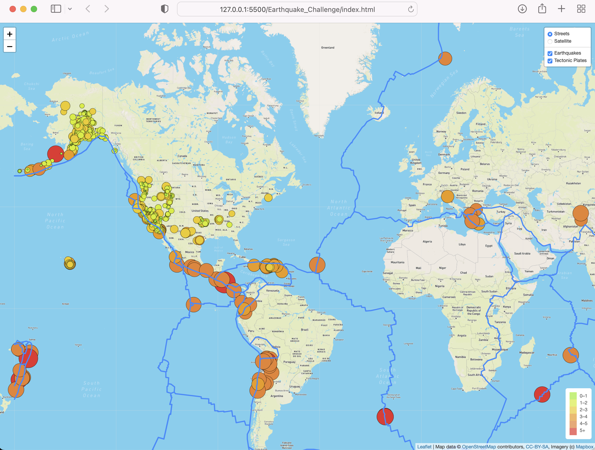
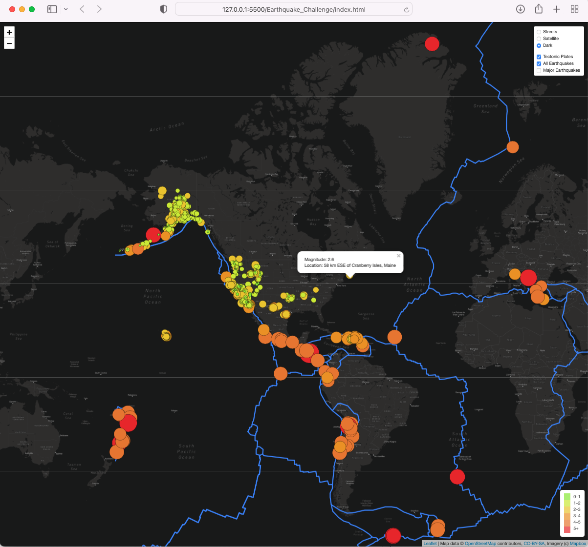

# Mapping_Earthquakes, Module 13 Challenge

Mapping_Earthquakes creates an interactive visualization of USGS' earthquake data, by latitude and longitude. Data markers for each earthquake show the magnitude as text, and as colored circles, where the size and color are larger and darker as the magnitude increases. Popups show additional information for each earthquake, like city, state, date and time. The color in the legend reflects the magnitude. The tectonic plates are also shown in the map, if selected.

## Deliverable 1

The tectonic plate data is added as a second layer group.

The tectonic plate data is added to the overlay object.

The d3.json() callback is working and does the following:

* The tectonic plate data is passed to the geoJSON() layer (file: tectonic_boundaries.json in "static" folder)
* The geoJSON() layer adds color and width to the tectonic plate lines
* The tectonic layer group variable is added to the map

The earthquake data and tectonic plate data are displayed on the map when the page loads.

## Deliverable 2

The major earthquake data is added as a third layer group.

The major earthquake data is added to the overlay object.

The d3.json() callback is working and does the following:

* Sets the color and diameter of each earthquake
* The major earthquake data is passed to the geoJSON() layer
* The geoJSON() layer creates a circle for each major earthquake, and adds a popup for each circle to display the magnitude and location of the earthquake
* The major earthquake layer group variable is added to the map

All the earthquake data and tectonic plate data are displayed on the map when the page loads and the datasets can be toggled on or off.

## Deliverable 3

A third map tile layer is created ("dark").

The third map is added to the overlay object.

All the earthquake data and tectonic plate data are displayed on the all maps of the webpage.

* "Dark"

* "Satellite"

